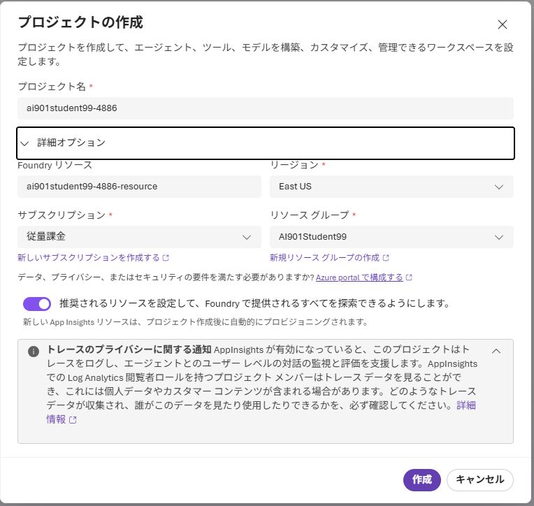
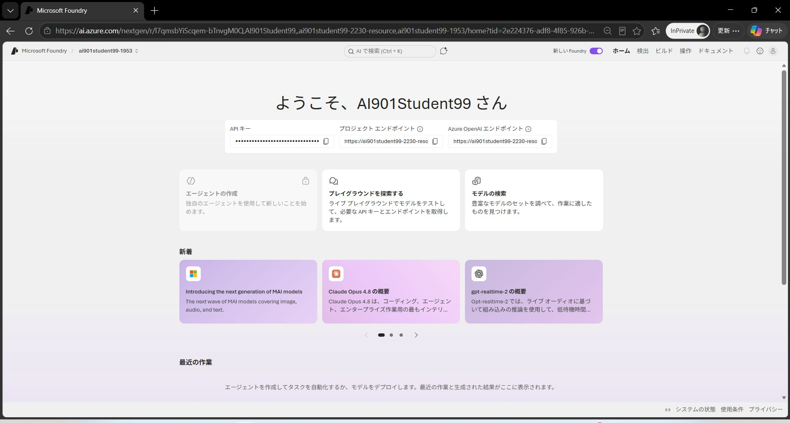

---
lab:
  title: 演習環境準備 - Microsoft Foundry プロジェクトの作成
  description: Microsoft Foundry プロジェクトを作成し、演習環境を準備します。
  level: 200
  duration: 10 minutes
  islab: true
  primarytopics:
    - Microsoft Foundry
---

# 演習環境準備: Microsoft Foundry プロジェクトの作成

この演習では、Microsoft Foundry プロジェクトを作成して演習環境を準備します。このプロジェクトは後続のすべての演習で使用します。

この演習の完了には約 **10** 分かかります。

> **注**: Microsoft Foundry ポータルを含む Microsoft Foundry の多くのコンポーネントは継続的に開発されています。これは人工知能技術の急速な進歩を反映しています。ユーザー エクスペリエンスの一部の要素が、この演習の画像や説明と異なる場合があります。

## Microsoft Foundry プロジェクトの作成

Microsoft Foundry は *プロジェクト* を使用して、AI ソリューションの開発に使用するモデル、リソース、データ、その他のアセットを整理します。プロジェクトは Azure の *Microsoft Foundry* リソースに関連付けられており、Azure 上での AI アプリとエージェント開発をサポートするために必要なクラウド サービスを提供します。

1. Web ブラウザーをInPrivateウィンドウ（シークレットウィンドウ）で開き、 <a href="https://ai.azure.com" target="_blank">Microsoft Foundry</a> (https://ai.azure.com)にアクセスします。画面右上にある　**[構築の開始]** をクリックして、Azure の資格情報を使用してサインインします。 **新しいプロジェクトの作成** ダイアログが開きます。**詳細オプション** エリアを展開して、プロジェクトの設定を確認します。

    

    次の項目を確認します
    - **プロジェクト名**: 自動生成された名前（例: `ai901studentXX-XXXX`）のまま変更しないでください
    - **Foundry リソース**: 自動生成されたリソース名のまま変更しないでください
    - **リージョン**：East US（異なるリージョンになっている場合は変更してください）
    - **サブスクリプション**: **従量課金** になっていることを確認します
    - **リソース グループ**: **AI901StudentXX**（XX は割り当てられた番号）になっていることを確認します

1. **作成** を選択します。プロジェクトが作成されるまで待ちます（数分かかる場合があります）。新しい Foundry ポータルでプロジェクトを作成または選択すると、次の画像のようなページが表示されます。

    

## まとめ

Microsoft Foundry プロジェクトの作成が完了しました。このプロジェクトは後続のすべての演習で使用します。次の演習に進んでください。
