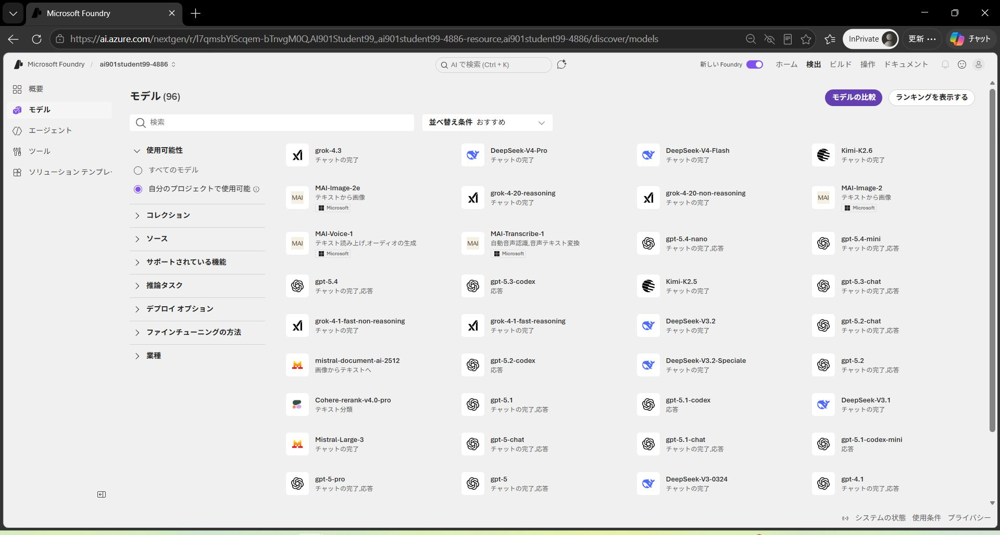
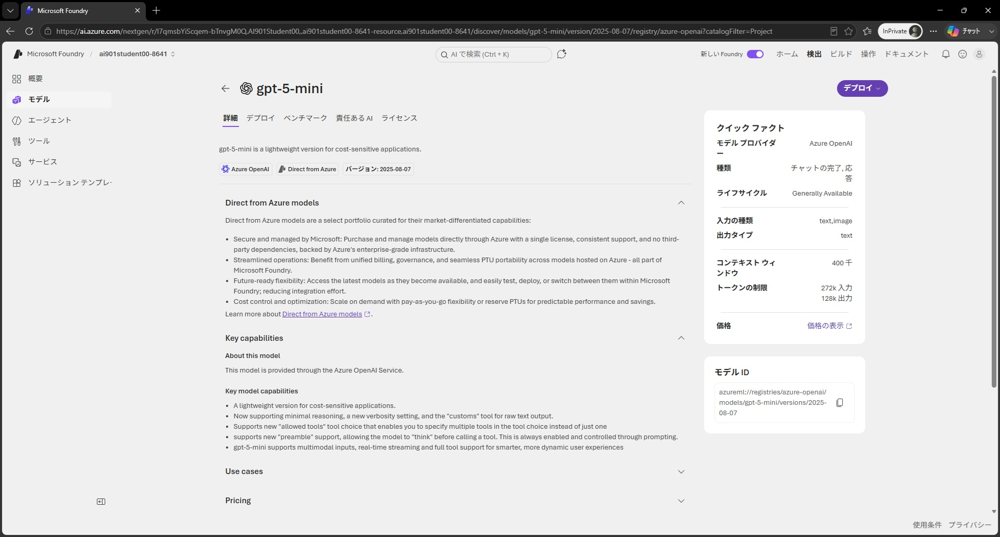
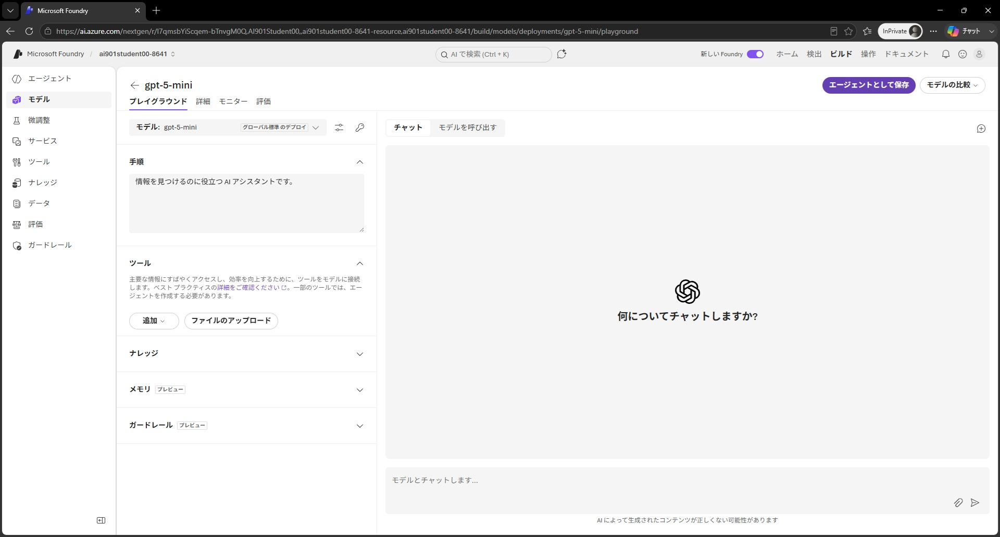
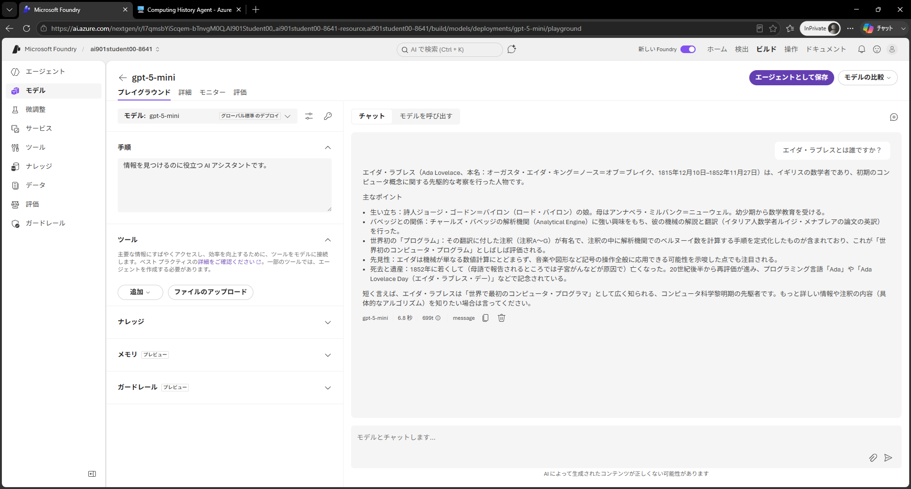

---
lab:
  title: Microsoft Foundry で生成 AI とエージェントをはじめよう
  description: Microsoft Foundry を使用して生成 AI モデルをデプロイし、エージェントを作成します。
  level: 200
  duration: 35 minutes
  islab: true
  primarytopics:
    - Microsoft Foundry
---

# Microsoft Foundry で生成 AI とエージェントをはじめよう

この演習では、Microsoft Foundry を使用して生成 AI モデルをデプロイして探索します。次に、そのモデルをナレッジ ツールを含むエージェントで使用して、ユーザーの質問に回答します。

> **前提条件**: 演習環境準備 (00) で作成した Microsoft Foundry プロジェクトを使用します。まだプロジェクトを作成していない場合は、先に 00 の演習を完了してください。

> **注**: Microsoft Foundry ポータルを含む Microsoft Foundry の多くのコンポーネントは継続的に開発されています。これは人工知能技術の急速な進歩を反映しています。ユーザー エクスペリエンスの一部の要素が、この演習の画像や説明と異なる場合があります。

この演習の完了には約 **35** 分かかります。

## モデルをデプロイする

すべての生成 AI アプリまたはエージェントの中心には言語モデルがあります。通常は大規模言語モデル（LLM）ですが、場合によってはよりコンパクトな小規模言語モデル（SLM）が使用されることもあります。

1. Web ブラウザーで `https://ai.azure.com` の <a href="https://ai.azure.com" target="_blank">Microsoft Foundry</a> を開き、Azure の資格情報を使用してサインインします。演習環境準備 (00) で作成したプロジェクトを選択します。

1. 画面上部のメニューで **[検出]** を選択して、移動した画面の左側のナビゲーション ペインで **モデル** を選択して、Microsoft Foundry モデル カタログを表示します。

    Microsoft Foundry は、AI アプリとエージェントで使用できる、Microsoft、OpenAI、その他のプロバイダーからの豊富なモデル コレクションを提供しています。

    

1. `gpt-5-mini` モデルを検索して選択し、その機能と特性が説明されたモデル ページを表示します。

    

1. **デプロイ** ボタンのドロップダウンから **既定の設定** を選択してデフォルト設定でモデルをデプロイします。デプロイには 1 分程度かかる場合があります。

    > **ヒント**: モデルのデプロイはリージョン クォータの制約を受けます。プロジェクトのリージョンでモデルをデプロイするのに十分なクォータがない場合は、gpt-4.1-nano や gpt-4o-mini など別のモデルを使用できます。または、別のリージョンに新しいプロジェクトを作成することもできます。

1. モデルがデプロイされたら、開いたモデル プレイグラウンド ページでモデルとチャットできます。

    

## モデルとチャットする

プレイグラウンドを使用して、モデルとチャットし、Instructions（*システム プロンプト*とも呼ばれます）やパラメーターを変更した際の影響を観察しながらモデルを探索できます。

1. 左側のナビゲーション ペイン下部にあるボタンを使用して折りたたみ、作業スペースを広げます。
1. **チャット** ペインで次のようなプロンプトを入力し、応答を確認します。

    ```
    エイダ・ラブレスとは誰ですか？
    ```

    

1. 次のような続きのプロンプトを入力して応答を確認します。

    ```
    チャールズ・バベッジとの研究についてもっと教えてください。
    ```

    > **注**: 生成 AI チャット アプリケーションはプロンプトに会話履歴を含めることが多いため、メッセージ間でコンテキストが保持されます。この場合、「彼女」はエイダ・ラブレスを指すものとして解釈されます。

1. チャット ペインの右上にある **新しいチャット** ボタンを使用して会話を再開します。これにより会話履歴がすべて削除されます。
1. 次のような新しいプロンプトを入力して応答を確認します。

    ```
    ELIZAチャットボットについて教えてください。
    ```

1. 次のようなプロンプトで会話を続けます。

    ```
    現代の LLM と比べてどうですか？
    ```

## モデルとチャットするためのクライアント コードを確認する

プレイグラウンドでモデルの応答に満足したら、モデルを利用するクライアント アプリケーションを開発できます。Microsoft Foundry は REST API と複数の言語固有の SDK を提供しており、デプロイされたモデルに接続してチャットできます。

1. **チャット** ペインで **コード** タブを表示します。このタブには、クライアント アプリケーションがモデルとチャットするために使用できるサンプル コードが表示されます。サンプル コードの上で次の設定を選択できます。
    - **API**: OpenAI API は、生成 AI モデルとの会話を実装するための一般的な標準です。使用できる OpenAI API のバリアントが 2 つあります。
        - **Completions**: モデルへのプロンプト送信に広く使用されるプログラム構文。
        - **Responses**: スタンドアロン モデルと *エージェント* の両方と会話するアプリ構築に優れた柔軟性を持つ新しい構文。
    - **Language**: Python、Microsoft C#、JavaScript など幅広いプログラミング言語でモデルを利用するコードを記述できます。
    - **SDK**: クライアントとモデル間の低レベルの通信詳細をカプセル化する言語固有の SDK を使用するか、クライアントがモデルに送信する HTTP リクエスト メッセージを完全制御できる REST API を直接使用できます。
    - **Authentication**: Microsoft Foundry にデプロイされたモデルを使用するには、クライアント アプリケーションが認証される必要があります。次の認証方法を実装できます。
        - **Key-based authentication**: クライアント アプリはセキュリティ キーを提示する必要があります（コード サンプル上のキー アイコンを選択すると確認できます）。
        - **Microsoft Entra ID authentication**: クライアント アプリは、割り当てられた ID（または現在のユーザー）に基づく認証トークンを提示します。

1. 次のコード オプションを選択します。
    - **API**: Responses API
    - **Language**: Python
    - **SDK**: OpenAI SDK
    - **Authentication**: Key authentication

    結果のサンプルは次のコードのようになります。

    ```python
    from openai import OpenAI
    
    endpoint = "https://{your-foundry-resource}.openai.azure.com/openai/v1/"
    deployment_name = "gpt-5-mini"
    api_key = "<your-api-key>"
    
    client = OpenAI(
        base_url=endpoint,
        api_key=api_key
    )
    
    response = client.responses.create(
        model=deployment_name,
        input="What is the capital of France?",
    )
    
    print(f"answer: {response.output[0]}")
    ```

    このコードは、秘密の認証キー（**api_key** 変数に設定する必要があります）を使用して Microsoft Foundry リソースの **OpenAI** エンドポイントに接続します。次に **responses.create** メソッドを使用して、入力プロンプト（この場合、ハードコーディングされた質問「What is the capital of France?」）からデプロイされたモデルの応答を生成し、出力コンソールに応答を印刷します。

## *システム プロンプト* で手順を指定する

これまでモデルを使用して一般的な情報を提供してきました。特定のユース ケースをサポートするには、*システム プロンプト* を使用してモデルに応答を導く手順を提供する必要があります。システム プロンプトを使用してモデルに特定のフォーカスや役割を与え、モデルが応答に含めるべきまたは含めるべきでない内容のフォーマット、スタイル、制約に関するガイドラインを提供できます。

例えば、ある組織が従業員の経費精算を支援する AI エージェントを強化するために生成 AI モデルを使用したいとします。

1. モデル プレイグラウンドで **チャット** タブに戻ります。チャット ペインの右上にある **新しいチャット** ボタンを使用して会話を再開し、会話履歴を削除します。
1. 左側のペインの **手順** テキスト エリアで、システム プロンプトを次のように変更します。

    ```
    あなたは従業員の経費精算をサポートする役立つ AI アシスタントです。経費に関連するトピックのみについて、簡潔で正確な情報を提供してください。経費に直接関連しないトピックについては情報を提供しないでください。
    ```

1. 経費精算に関連する新しいユーザー プロンプトを入力します。例えば次のようなものです。

    ```
    一般的に会社に経費精算できるビジネス経費の種類は何ですか？
    ```

    応答を確認します。経費精算に関する一般的なガイダンスが提供されるはずです。

1. システム プロンプトが変更された状態で、以前に尋ねた経費と無関係な質問を再度試してみましょう。例えば次のようなプロンプトで応答を比較してください。

    ```
    ELIZAチャットボットについて教えてください。
    ```

    これまではプレイグラウンドで Instructions を指定しましたが、その環境の外では保存されません。クライアント アプリケーションでは、**responses.create** メソッドの **instructions** パラメーターとしてシステム プロンプトを含める必要があります。例えば次のようにします。

    ```python
    response = client.responses.create(
            model=deployment_name,
            instructions="""
                あなたは従業員の経費精算をサポートする役立つ AI アシスタントです。
                経費に関連するトピックのみについて、簡潔で正確な情報を提供してください。
                経費に直接関連しないトピックについては情報を提供しないでください。
            """
            input="一般的に会社に経費精算できるビジネス経費の種類は何ですか？",
        )
    ```

    手順とモデルを単一の AI エンティティにカプセル化するには、構成を *エージェント* として保存する必要があります。

## モデル構成をエージェントとして保存する

スタンドアロン モデルを使用して生成 AI アプリを実装することもできますが、完全にエージェント的な AI エクスペリエンスを作成するには、モデル、その Instructions、および追加機能を提供するツール構成を *エージェント* にカプセル化する必要があります。

1. モデル プレイグラウンドの右上で **エージェントとして保存** を選択します。プロンプトが表示されたら、新しいエージェントに `expenses-agent` という名前を付けます。

    エージェントが作成されると、エージェント専用の新しいプレイグラウンドで開きます。

    

1. 右側のペインで **YAML** タブを表示します。このタブにはエージェントの定義が含まれています。その定義にはモデル、パラメーター設定、指定した Instructions が含まれていることを確認してください。次のような内容になっているはずです。

    ```yml
    metadata:
      logo: Avatar_Default.svg
      microsoft.voice-live.enabled: "false"
    object: agent.version
    id: expenses-agent:1
    name: expenses-agent
    version: "1"
    description: ""
    created_at: 1776115196
    definition:
      kind: prompt
      model: gpt-5-mini
      instructions: あなたは従業員の経費精算をサポートする役立つ AI アシスタントです。経費に関連するトピックのみについて、簡潔で正確な情報を提供してください。経費に直接関連しないトピックについては情報を提供しないでください。
      temperature: 1
      top_p: 1
      tools: []
    status: active
    ```

1. **Chat** タブに戻り、次のプロンプトを入力します。

    ```
    あなたは誰ですか？
    ```

    応答にはエージェントが経費精算アドバイザーとしての役割を「認識」していることが示されるはずです。

1. 経費に関連するプロンプトを入力します。例えば次のようなものです。

    ```
    タクシー代はいくら請求できますか？
    ```

    応答はおそらく一般的なものになるでしょう。正確ですが、従業員にとってはあまり役に立ちません。会社の経費ポリシーと手順に関するナレッジをエージェントに与える必要があります。

## エージェントにナレッジ ツールを追加する

エージェントは *ツール* を使用してタスクを実行したり情報を見つけたりします。一般的な Web 検索ツールやシンプルなファイル検索ツールを使用してナレッジ ソースを提供することも、より包括的なエージェント ソリューションとして *Microsoft Foundry IQ* ナレッジ ストアを作成して企業内の 1 つ以上のデータ ソースにエージェントを接続することもできます。この演習では、シンプルなファイル検索ツールを使用します。

1. 新しいブラウザー タブを開き、`https://microsoftlearning.github.io/mslearn-ai-fundamentals/data/expenses_policy.docx` の **<a href="https://microsoftlearning.github.io/mslearn-ai-fundamentals/data/expenses_policy.docx" target="_blank">expenses_policy.docx</a>** を表示します。これを経費精算に関する質問に回答するためにエージェントが使用するナレッジ ソースとして使用します。
1. **expenses_policy.docx** をローカル コンピューターにダウンロードします。
1. エージェント プレイグラウンドを含むタブに戻り、左側のペインで **ツール** セクションをまだ展開していない場合は展開します。
1. **expenses_policy.docx** ファイルをアップロードし、デフォルトのインデックス名で新しいインデックスを作成します。インデックスが作成されたら、エージェントにアタッチします。
1. エージェント プレイグラウンドの上部にある **保存** ボタンを使用してエージェント定義を更新します。
1. 右側のペインで **YAML** タブを表示します。エージェントの定義に追加したファイル検索ツールが（**tools** セクションに）含まれていることを確認してください。

    ```yml
    metadata:
      logo: Avatar_Default.svg
      description: ""
      modified_at: "1776115781"
      microsoft.voice-live.enabled: "false"
    object: agent.version
    id: expenses-agent:2
    name: expenses-agent
    version: "2"
    description: ""
    created_at: 1776115782
    definition:
      kind: prompt
      model: gpt-5-mini
      instructions: あなたは従業員の経費精算をサポートする役立つ AI アシスタントです。経費に関連するトピックのみについて、簡潔で正確な情報を提供してください。経費に直接関連しないトピックについては情報を提供しないでください。
      temperature: 1
      top_p: 1
      tools:
        - type: file_search
          vector_store_ids:
            - vs_tmwFZKmfVB3rZJoeaJAcgdy9
    status: active
    ```

1. **Chat** タブに戻り、先ほどと同じ経費に関連するプロンプトを入力して（例：`タクシー代はいくら請求できますか？`）応答を確認します。

    今度の応答は経費データ ソースの情報に基づいたものになるはずです。

1. さらにいくつかの経費に関連するプロンプトを試してみましょう。例えば次のようなものです。

    ```
    ホテルはどうですか？
    ```

    ```
    夕食代は請求できますか？
    ```

    おめでとうございます！必要なナレッジにアクセスできる動作するエージェントが完成しました。

## エージェントをプレビューする

動作するエージェントができたので、基本的な Web チャット アプリケーションでプレビューできます。

1. Foundry ポータルのエージェント プレイグラウンドで、チャット ペイン上部の **プレビュー** ドロップダウン リストから **エージェントのプレビュー** を選択します。

    プレビュー チャット インターフェイスが新しいブラウザー タブで開きます。

1. 次のようなプロンプトを入力し、エージェントからの応答を確認します。

    ```
    経費精算の申請方法を教えてください。
    ```

    

## まとめ

この演習では、Microsoft Foundry ポータルで生成 AI モデルをデプロイしてチャットする方法を探索しました。次にモデルをエージェントとして保存し、アプリケーションへのエージェントの統合オプションを探索する前に、エージェントに Instructions とツールを設定しました。

この演習で探索したエージェントは、Microsoft Foundry を使用して生成 AI アプリとエージェント開発をいかに素早く簡単に始められるかを示すシンプルな例です。この基盤から、エージェントがツールを使用して情報を検索しタスクを自動化し、複雑なワークフローを実行するために互いに連携する包括的なエージェント ソリューションを構築できます。

