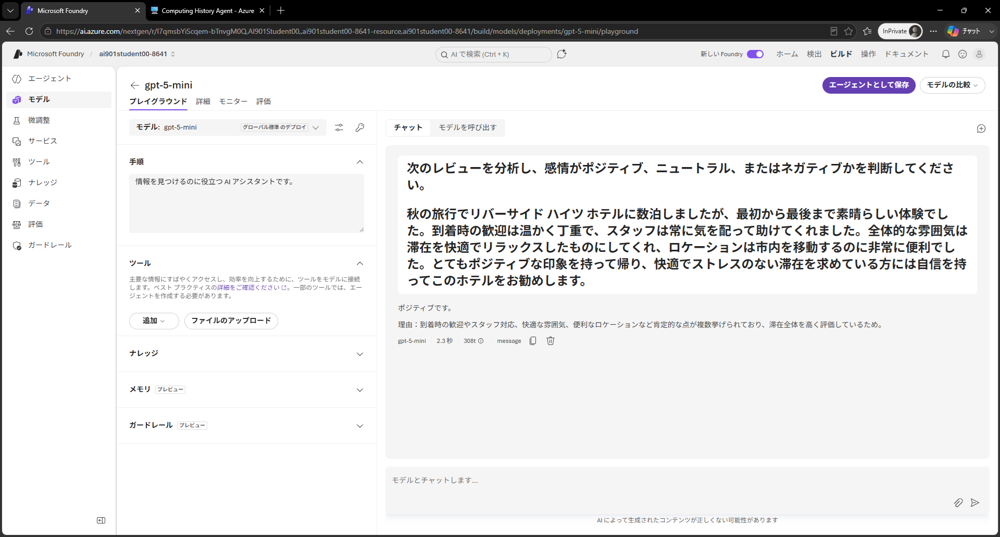
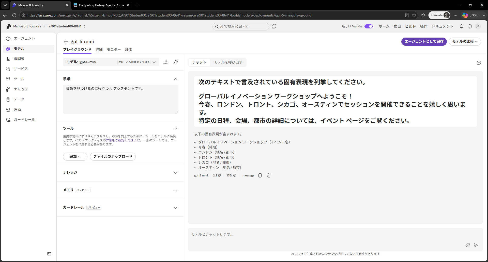
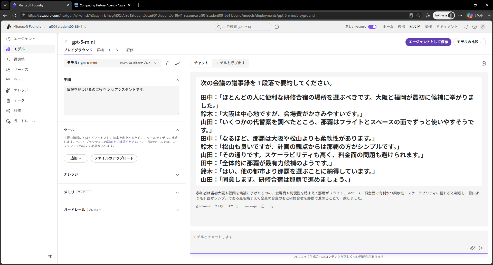
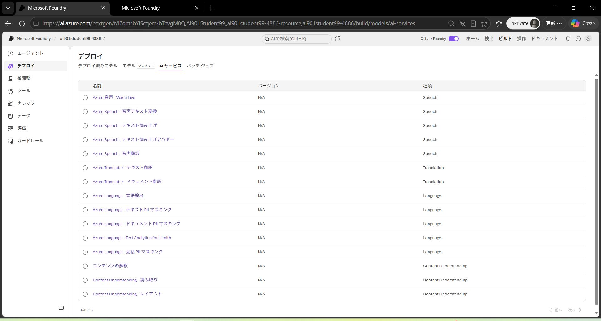
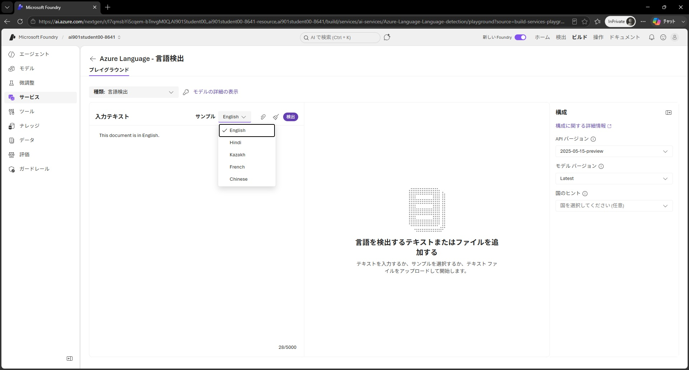
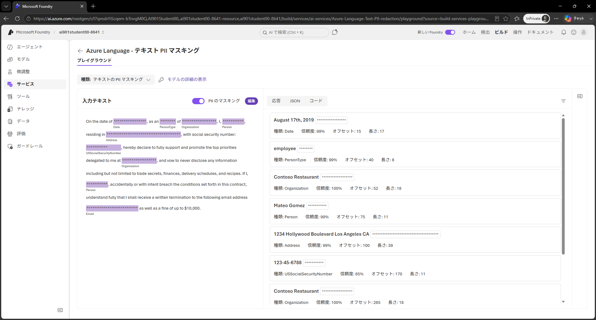

---
lab:
  title: Microsoft Foundry でテキスト分析をはじめよう
  description: Microsoft Foundry を使用してさまざまな種類のテキスト分析を試します。
  primarytopics:
    - Microsoft Foundry
---

# Microsoft Foundry でテキスト分析をはじめよう

この演習では、Microsoft の AI アプリケーション作成プラットフォームである **Microsoft Foundry** を使用して、一般的な *テキスト分析技術* を探索します。

Foundry はテキスト分析に *2 つのアプローチ* を提供します。**汎用 AI モデル** は自然言語プロンプトを通じて幅広いタスクに対応し、**専用の言語ツール** は特定のタスクに対して構造化された確定的な結果を返します。両方を探索することで、それぞれのアプローチをいつ使用すべきかについての明確な理解が得られます。

この演習の第 1 部では、*新しい* Foundry ポータルのチャット プレイグラウンドで汎用 AI モデルを使用します。第 2 部では、Foundry ツールの Azure Language の一部の機能を探索します。

この演習の所要時間は約 **20** 分です。

> **前提条件**: 演習環境準備 (00) で作成した Microsoft Foundry プロジェクトを使用します。まだプロジェクトを作成していない場合は、先に 00 の演習を完了してください。

## パート 1: 汎用 AI モデルのテキスト分析機能を探索する

この演習の第 1 部では、*新しい* Foundry ポータルと汎用の言語モデルを使用して、自然言語プロンプトを通じてテキスト分析を実行します。言語モデルはプロンプトのみで幅広い種類のタスクを処理できます。

1. Web ブラウザーで `https://ai.azure.com` の <a href="https://ai.azure.com" target="_blank">Microsoft Foundry</a> を開き、Azure の資格情報を使用してサインインします。演習環境準備 (00) で作成したプロジェクトを選択します。

2. 画面上部のメニューで **[検出]** を選択して、移動した画面の左側のナビゲーション ペインで **モデル** を選択して Microsoft Foundry モデル カタログを表示します。

    

3. `gpt-5-mini` モデルを検索して選択し、その機能と特性が説明されたモデル ページを表示します。

    

3. **デプロイ** ボタンのドロップダウンから **既定の設定** を選択して *デフォルト設定* でモデルをデプロイします。デプロイが完了するまで待ちます。デプロイが完了すると、チャット プレイグラウンドに移動し、モデルの機能をテストできます。

### 感情分析

**感情分析** は一般的な *自然言語処理*（NLP）タスクです。テキストがポジティブ、ニュートラル、またはネガティブな感情を伝えているかを判断するために使用され、レビュー、ソーシャル メディアの投稿、その他の主観的なドキュメントの分類に役立ちます。

1. チャット プレイグラウンドで次のプロンプトを入力します。

    ```
    次のレビューを分析し、感情がポジティブ、ニュートラル、またはネガティブかを判断してください。
    ---
    秋の旅行でリバーサイド ハイツ ホテルに数泊しましたが、最初から最後まで素晴らしい体験でした。到着時の歓迎は温かく丁重で、スタッフは常に気を配って助けてくれました。全体的な雰囲気は滞在を快適でリラックスしたものにしてくれ、ロケーションは市内を移動するのに非常に便利でした。とてもポジティブな印象を持って帰り、快適でストレスのない滞在を求めている方には自信を持ってこのホテルをお勧めします。
    ---
    ```

1. 応答を確認します。テキストの感情分析が含まれているはずです。

    

1. 別のレビューを分析するために次のプロンプトを入力します。

    ```
    次はどうですか？
    ---
    今年初めにハーバー ビュー インを訪問しましたが、期待を大きく下回りました。フロント デスクの手続きに予想より時間がかかり、スタッフの対応は急かされているようで親切ではありませんでした。客室には継続的なメンテナンスの問題があり、インターネット接続が不安定で、廊下からの騒音が夜通し目立ちました。全体的に期待を下回る体験で、再び宿泊しようとは思いません。
    ---
    ```

    独自のプロンプトを作成してさらに実験することもできます。

### 固有表現の抽出

**固有表現** とは、テキスト内で言及されている人物、場所、日付、その他の重要な項目です。

1. チャット ペインの上部にある **New chat**（&#128172;）ボタンを使用して会話を再開します。これにより会話履歴がすべて削除されます。

2. 次のプロンプトを入力して結果を確認します。

    ```
    次のテキストで言及されている固有表現を列挙してください。
    ---
    グローバル イノベーション ワークショップへようこそ！
    今春、ロンドン、トロント、シカゴ、オースティンでセッションを開催できることを嬉しく思います。
    特定の日程、会場、都市の詳細については、イベント ページをご覧ください。
    ---
    ```

    モデルはテキスト内で言及されている特定の場所を識別するはずです。

    

### テキストの要約

**要約** はドキュメントの主要なポイントをより短いテキストに凝縮する方法です。

1. チャット ペインの上部にある **New chat**（&#128172;）ボタンを使用して会話を再開します。これにより会話履歴がすべて削除されます。
1. 次のプロンプトを入力して結果を確認します。

    ```
    次の会議の議事録を 1 段落で要約してください。
    ---
    田中：「ほとんどの人に便利な研修合宿の場所を選ぶべきです。大阪と福岡が最初に候補に挙がりました。」
    鈴木：「大阪は中心地ですが、会場費がかさみやすいです。」
    山田：「いくつかの代替案を調べたところ、那覇はフライトとスペースの面でずっと使いやすそうです。」
    田中：「なるほど、那覇は大阪や松山よりも柔軟性があります。」
    鈴木：「松山も良いですが、計画の観点からは那覇の方がシンプルです。」
    山田：「その通りです。スケーラビリティも高く、料金面の問題も避けられます。」
    田中：「全体的に那覇が最有力候補のようです。」
    鈴木：「はい、他の都市より那覇を選ぶことに納得しています。」
    山田：「同意します。研修合宿は那覇で進めましょう。」
    ---
    ```

    モデルはテキストの要約を生成するはずです。

    

## パート 2: 専門の言語分析ツールを使用する

汎用の生成 AI ワークロード向けにトレーニングされた言語モデルはテキスト分析を上手く行える場合が多いですが、より専門的なツールをエージェントが使用することで、より予測可能な結果を得られる場合があります。

**Azure Language in Foundry Tools** は統計的手法を使用して構造化された確定的な結果を返す専用アナライザーを提供しています。これは自動化されたパイプラインで一貫した出力を得るのに理想的です。

1. *新しい* Foundry ポータルで、画面上部のメニューに移動して **ビルド** を選択します。

2. *ビルド* ページで、左側のメニューから **サービス** を選択します。

    

### 言語の検出

テキストが複数の言語のいずれかで記述されている可能性がある場合、分析ワークフローの最初のステップは、後続の処理に最も適切なモデルやエージェントにテキストをルーティングできるよう、主要言語を決定することです。

1. AI サービスの一覧から **Azure Language - 言語検出** アナライザーを選択します。
2. **入力テキスト** リストで提供されているサンプル ドキュメントの 1 つを選択します。次に **検出** ボタンを使用して、サンプルが書かれている言語を検出します。

    

3. 検出された言語の詳細を確認した後、**編集** ボタン アイコンをクリックして入力テキストを再度編集可能にします。これにより次のことができます。
    - 別のサンプルを選択する
    - 独自のテキストを入力する
    - テキスト ファイルをアップロードする

    例えば、次の入力テキストを入力してその言語を検出します。

    ```
    ¡Hola! Me llamo Josefina y vivo en Madrid, España. Soy doctora en un hospital, ¡lo que me mantiene muy ocupada!
    ```

4. 独自の入力でさらに実験してみましょう。

5. 実験が終わったら、AI サービスの一覧に戻ります。プレイグラウンド画面上部の戻るボタンをクリックしてください。

### テキスト内の PII を特定する

プライバシー ポリシーや法律を遵守するため、組織は名前、住所、電話番号、メール アドレス、その他の個人的な詳細などの **個人を特定できる情報（PII）** を検出してマスクする必要があることが多いです。

1. AI サービスの一覧から **Azure Language - テキスト PII マスキング** アナライザーを選択します。
2. **入力テキスト** リストで提供されている **サンプル** ドキュメントリストから 1 つを選択します。次に **検出** ボタンを使用してテキスト内の PII 値を検出します。

    

3. 検出された PII の詳細を確認した後、**編集** ボタンをクリックして入力テキストを再度編集可能にします。これにより次のことができます。
    - 別のサンプルを選択する
    - 独自のテキストを入力する
    - テキスト ファイルをアップロードする

    例えば、次の入力テキストを入力してその PII を検出します。

    ```
    Maria Garcia called from 020 7946 0958 and asked to send documents to 42 Market Road, London, UK, SW1A 1AA.
    ```

4. 独自の入力でさらに実験してみましょう。Azure Language は PII の広範なリストを認識できます。完全なリストは[こちら](https://learn.microsoft.com/azure/ai-services/language-service/personally-identifiable-information/concepts/entity-categories-list)で確認できます。いくつかのエンティティ例を挙げると次のとおりです。

    - 人物名
    - メール アドレス
    - 電話番号
    - 住所

### サンプル コードを確認する

Foundry は一部の Azure Language 機能のサンプル コードを提供しています。サンプル コードを使用して独自のクライアント アプリケーションの作成を始めることができます。

> タイミングによってはこのタスクを実行できない（表示されない）場合があります

1. 右側の **コード** タブを選択して PII 識別のサンプル コードを表示します。

    

>**ヒント**: 参考として以下に Python のサンプル コードを示します。コードをコピーして Visual Studio Code などの好みの Python 開発環境で実行できます。Azure Language のエンドポイントとキーの環境変数を作成する必要があります。これらはコード サンプル ウィンドウで確認できます。

```python

    key = "paste-your-key-here"
    endpoint = "paste-your-endpoint-here"

    from azure.ai.textanalytics import TextAnalyticsClient
    from azure.core.credentials import AzureKeyCredential

    # Authenticate the client using your key and endpoint 
    def authenticate_client():
        ta_credential = AzureKeyCredential(key)
        text_analytics_client = TextAnalyticsClient(
                endpoint=endpoint, 
                credential=ta_credential)
        return text_analytics_client

    client = authenticate_client()

    # Example method for detecting sensitive information (PII) from text 
    def pii_recognition_example(client):
        documents = [
            "$documents"
        ]
        response = client.recognize_pii_entities(documents, language="en")
        result = [doc for doc in response if not doc.is_error]
        for doc in result:
            print("Redacted Text: {}".format(doc.redacted_text))
            for entity in doc.entities:
                print("Entity: {}".format(entity.text))
                print(" Category: {}".format(entity.category))
                print(" Confidence Score: {}".format(entity.confidence_score))
                print(" Offset: {}".format(entity.offset))
                print(" Length: {}".format(entity.length))
    pii_recognition_example(client)
```

## まとめ

この演習では、生成 AI モデルと Foundry の Azure Language ツールを使用してテキストを分析する方法を探索しました。多くのシナリオでは、生成 AI モデルのネイティブな言語機能が必要なすべての自然言語処理機能を提供します。より専門的なシナリオでは、Azure Language ツールが NLP タスクのための専用サービスを提供します。

## 詳細を学ぶ

- [Foundry の進化](https://learn.microsoft.com/azure/foundry/what-is-foundry#evolution-of-foundry)を確認する
- [Azure Language in Foundry Tools](https://learn.microsoft.com/azure/ai-services/language-service/overview) について詳しく読む
- [個人を特定できる情報（PII）の検出](https://learn.microsoft.com/azure/ai-services/language-service/personally-identifiable-information/overview) について詳しく学ぶ
