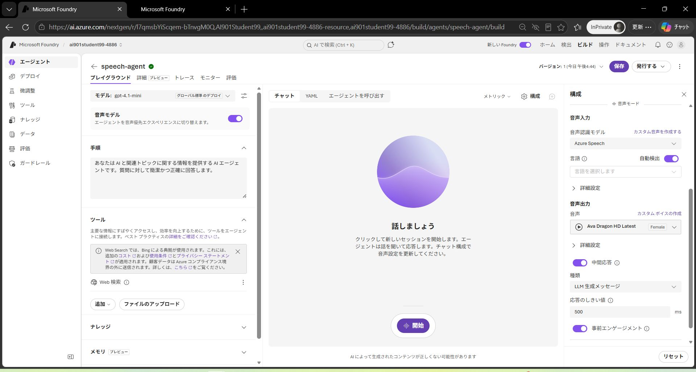
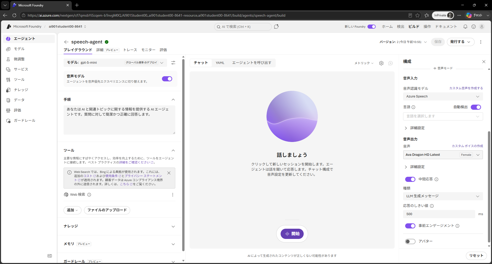

---
lab:
  title: Microsoft Foundry で音声をはじめよう
  description: Microsoft Foundry を使用して Azure Speech - Voice Live を試します。
  level: 200
  duration: 25 minutes
  islab: true
  primarytopics:
    - Azure
    - Microsoft Foundry
---

# Microsoft Foundry で音声をはじめよう

音声対応の AI エージェントにより、ユーザーは音声コマンドや質問を使って会話形式で対話し、音声で応答を受け取ることができます。

この演習では、Microsoft Foundry ツールの Azure Speech を使用して音声対応エージェントを作成します。リアルタイムの音声ベース エージェントを構築するために使用されるサービスである Azure Speech Voice Live を使用します。

この演習の所要時間は約 **25** 分です。

> **前提条件**: 演習環境準備 (00) で作成した Microsoft Foundry プロジェクトを使用します。まだプロジェクトを作成していない場合は、先に 00 の演習を完了してください。

## エージェントを作成する

それではエージェントを作成しましょう。

1. Web ブラウザーで `https://ai.azure.com` の <a href="https://ai.azure.com" target="_blank">Microsoft Foundry</a> を開き、Azure の資格情報を使用してサインインします。演習環境準備 (00) で作成したプロジェクトを選択します。

1. **エージェントの構築**（または **ビルド** ページの **エージェント** タブ）を選択し、`speech-agent` という名前の新しいエージェントを作成します。

     準備が整うと、エージェント プレイグラウンドでエージェントが開きます。

    

1. モデルのドロップダウン リストで、**gpt-5-mini** モデルがデプロイされエージェントに選択されていることを確認します。
1. エージェントに次の **手順** を割り当てます。

    ```
    あなたは AI と関連トピックに関する情報を提供する AI エージェントです。質問に対して簡潔かつ正確に回答します。
    ```

1. 画面右上にある **保存** ボタンを使用して変更を保存します。
1. **チャット** ペインで次のプロンプトを入力してエージェントをテストします。

    ```
    どのようなことをお手伝いできますか？
    ```

    エージェントは Instructions に基づいて適切な回答で応答するはずです。

## Azure Speech Voice Live を設定する

Foundry エージェントの音声モードを有効にすると Azure Speech Voice Live が統合され、エージェントに音声機能が追加されます。

1. 左側のペインで、モデル選択リストの下にある **音声モデル** を有効にします。

    **構成** ペインが自動的に開かない場合は、チャット インターフェイス上部の「歯車」アイコンを使用して開きます。

1. **構成** ペインで **音声モード** の下にある、デフォルトの音声入力と出力の設定を確認します。さまざまな音声を試してプレビューし、使用する音声を決定できます。
1. **構成** ペインを閉じ、**保存** ボタンを使用してエージェントを保存します。

## 音声を使用してエージェントと対話する

エージェントとチャットする準備ができました。

1. チャット ペインで **開始** ボタンを使用してエージェントとの会話を開始します。プロンプトが表示されたら、システム マイクへのアクセスを許可します。

    エージェントが音声セッションを開始し、プロンプトを待機します。

    

1. アプリのステータスが **聞いています…** になったら、「**音声認識はどのように機能しますか？**」と言って応答を待ちます。

1. アプリのステータスが **Processing…** に変わることを確認します。アプリは音声入力を処理します。

    >**ヒント**: 処理速度が非常に速いため、*Speaking* に変わる前にこのステータスが表示されない場合があります。

1. ステータスが **Speaking…** に変わると、アプリはテキスト読み上げを使用してモデルの応答を音読します。元のプロンプトと応答をテキストとして表示するには、チャット画面下部の **cc** ボタンを選択します。

    >**ヒント**: 続きのプロンプトは話すだけで送信できます。エージェントに割り込んで、必要なことに集中させることもできます。チャット ペインの **生成の停止** ボタンを使用して長時間の応答を停止することもできます。このボタンを使用すると会話が終了します。エージェントの使用を続けるには新しい会話を開始する必要があります。

1. 会話を続けるには、「**音声合成はどのように機能しますか？**」などの別の質問をして応答を確認します。
1. エージェントとのチャットが終わったら、**X** アイコンを使用してセッションを終了します。会話のトランスクリプトが表示されます。

## クライアント コードを確認する

カスタム アプリケーションでエージェントを使用するには、Azure Speech Voice Live SDK を使用してストリーミング音声の入力と出力を処理するコードを記述する必要があります。

1. チャット画面の上部にある **コード** を選択して、エージェント クライアントのサンプル コードを表示します。
1. コードを確認します。次の処理が含まれていることに注目してください。
    - エージェントにアクセスするためのプロジェクトへの接続
    - 入力と出力の音声ストリーミング
    - マイクやスピーカーなどの音声デバイスの使用

## まとめ

この演習では、Microsoft Foundry の Azure Speech Voice Live ツールとそれを使用した会話エージェントの構築方法を探索しました。Azure Speech には、音声を文字起こしするか、テキストから音声出力を生成する AI アプリケーションとエージェントを構築するために使用できる複数の音声機能が含まれています。

