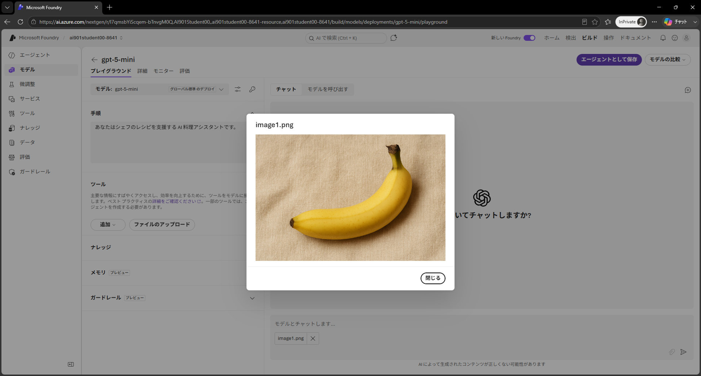
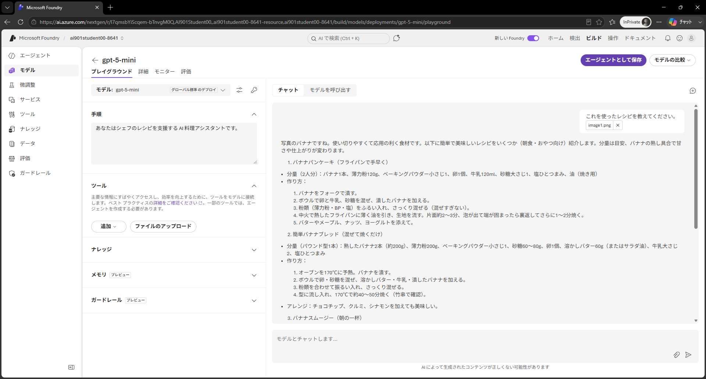
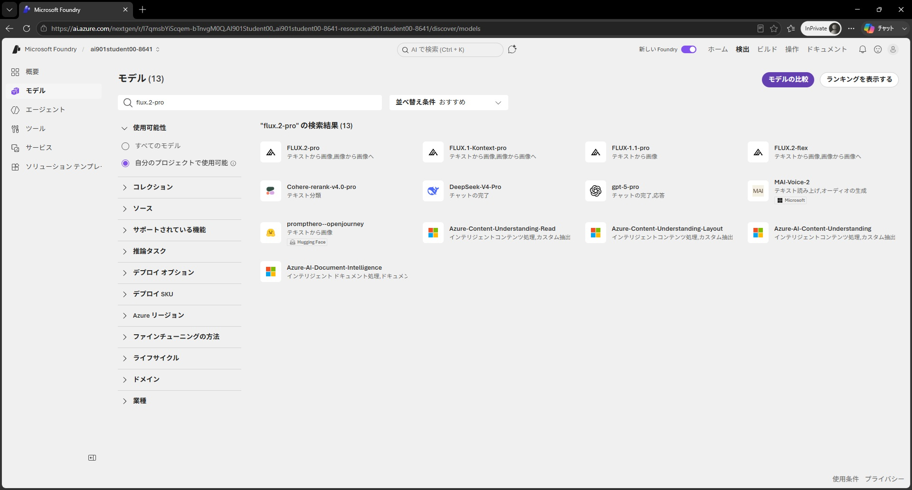

---
lab:
  title: Microsoft Foundry でコンピューター ビジョンをはじめよう
  description: 生成 AI モデルを使用して視覚データを解釈・生成します。
  level: 200
  duration: 30 minutes
  islab: true
  primarytopics:
    - Microsoft Foundry
---

# Microsoft Foundry でコンピューター ビジョンをはじめよう

この演習では、Microsoft Foundry の生成 AI モデルを使用して視覚データを処理します。

この演習の完了には約 **30** 分かかります。

> **前提条件**: 演習環境準備 (00) で作成した Microsoft Foundry プロジェクトを使用します。まだプロジェクトを作成していない場合は、先に 00 の演習を完了してください。

## 生成 AI モデルを使用して画像を分析する

コンピューター ビジョン モデルにより、AI システムは写真、動画、その他の視覚的な要素などの画像ベースのデータを解釈できます。この演習では、料理を志すシェフを助ける AI エージェントの開発者が、ビジョン対応モデルを使用して食材の画像を解釈し、関連するレシピを提案する方法を探索します。

1. 新しいブラウザー タブで、`https://microsoftlearning.github.io/mslearn-ai-fundamentals/data/images.zip` の **<a href="https://microsoftlearning.github.io/mslearn-ai-fundamentals/data/images.zip" target="_blank">images.zip</a>** をローカル コンピューターにダウンロードします。

1. ダウンロードしたアーカイブをローカル フォルダーに展開して、含まれるファイルを確認します。これらのファイルが AI で分析する画像です。

1. Web ブラウザーで `https://ai.azure.com` の <a href="https://ai.azure.com" target="_blank">Microsoft Foundry</a> を開き、Azure の資格情報を使用してサインインします。演習環境準備 (00) で作成したプロジェクトを選択します。

1. 左側のナビゲーション ペインで **モデル** を選択して、Microsoft Foundry モデル カタログを表示します。

1. `gpt-5-mini` モデルを検索し、**デプロイ** ボタンのドロップダウンから **既定の設定** を選択してデプロイします。デプロイには 1 分程度かかる場合があります。

    > **ヒント**: モデルのデプロイはリージョン クォータの制約を受けます。プロジェクトのリージョンでモデルをデプロイするのに十分なクォータがない場合は別のモデルを使用できます。または、別のリージョンに新しいプロジェクトを作成することもできます。

1. モデルがデプロイされたら、開いたモデル プレイグラウンド ページでモデルとチャットできます。

    

1. 左側のペインで **手順** を次のように設定します。

    ```
    あなたはシェフのレシピを支援する AI 料理アシスタントです。
    ```

1. チャット ペインの入力欄にある画像添付ボタン（クリップアイコン）を使用して、コンピューターに展開した画像の 1 つを選択します。画像がプロンプト エリアに追加されます。

    追加した画像を選択して確認できます。

   

1. 次のようなプロンプト テキストを入力して、アップロードした画像とテキストの両方が含まれるプロンプトを送信します。

    ```
    これを使ったレシピを教えてください。
    ```

1. 応答を確認します。アップロードした画像に関連するレシピの提案が含まれているはずです。

   

    > **注**: エラー *ERR_BAD_REQUEST: The provided data does not match the expected schema* が返された場合は、**新しい Foundry** オプションの選択を解除して *クラシック* ポータルに切り替えてみてください。クラシック ポータルでは、**Playgrounds** ページの **Chat playground** を開いてください。

1. 他の画像を含むプロンプトを送信します。例えば次のようなものです。

    ```
    これはどのように調理しますか？
    ```

    ```
    これでどんなデザートが作れますか？
    ```

### コードを確認する

モデルを使用して画像を解釈するクライアント アプリやエージェントを開発するには、OpenAI **Responses** API を使用できます。

1. **チャット** ペインで **モデルを呼び出す** タブを選択してサンプル コードを表示します。

1. 次のコード オプションを選択します。
    - **言語**: Python
    - **認証方法**: Key authentication
    
    デフォルトのサンプル コードにはテキストベースのプロンプトのみが含まれています。画像を分析するプロンプトを送信するには、次に示すように **input** パラメーターにテキストと画像コンテンツの両方を含めるように変更できます。

    ```python
    from openai import OpenAI
    
    endpoint = "https://your-project-resource.openai.azure.com/openai/v1/"
    deployment_name = "gpt-5-mini"
    api_key = "<your-api-key>"
    
    client = OpenAI(
        base_url=endpoint,
        api_key=api_key
    )
    
    response = client.responses.create(
        model=deployment_name,
        input=[{
            "role": "user",
            "content": [
                {"type": "input_text", "text": "what's in this image?"},
                {"type": "input_image", "image_url": "https://an-online-image.jpg"},
            ],
        }],
    )
    
    print(f"answer: {response.output[0]}")
    ```

## 生成 AI モデルを使用して新しい画像を作成する

これまでは生成 AI モデルが視覚的な入力を処理する機能を探索しました。次に、AI シェフ エージェントの Web サイトに適した画像が必要な場合を想定します。モデルが視覚的な出力を生成できるかどうか見てみましょう。

> **注**: このタスクには画像生成モデルへのアクセス権を持つサブスクリプションが必要です。

1. 画面上部のメニューで **[検出]** を選択して、移動した画面の左側のナビゲーション ペインで **モデル** を選択してモデル カタログを表示します。
1. 検索ボックスに `FLUX.1-Kontext-pro` と入力して直接検索します。

   

    > **注**: サブスクリプションで利用可能なモデルは異なる場合があります。また、モデルのデプロイはリージョンの利用可能性とクォータによって異なります。

1. 検索結果から **FLUX.1-Kontext-pro** を選択し、**デプロイ** ボタンのドロップダウンから **既定の設定** を選択してデプロイします。

1. モデルがデプロイされると、画像プレイグラウンドが開きます。
1. 希望する画像を説明するプロンプトを入力します。例えば次のようなものです。

    ```
    A chef preparing a meal.
    ```

    生成された画像を確認します。

   

### コードを確認する

モデルを使用して画像を生成するクライアント アプリやエージェントを開発したい場合は、OpenAI API を使用できます。

> **注**: モデルの利用可能性とプレイグラウンドの機能は異なる場合があります。画像生成モデルによっては **コード** タブや **View code** オプションが表示されない場合があります。選択したモデルにコード サンプルが含まれていない場合でも、プレイグラウンドで画像を生成することで演習を完了できます。または、コード サンプルを公開する別のデプロイ済みテキストから画像へのモデルを使用してください。

1. デプロイしたモデルにコード サンプルが含まれている場合は、**チャット** ペインで **コードの表示** ボタンをクリックサンプル コードを表示します。

1. 次のコード オプションを選択します。
    - **言語**: Python
    - **SDK**: OpenAI SDK
    - **認証方法**: Key authentication

    デフォルトのサンプル コードは次のようになっているはずです。

    ```python
    import base64
    from openai import OpenAI
    
    endpoint = "https://your-project-resource.openai.azure.com/openai/v1/"
    deployment_name = "your-text-to-image-model-deployment"
    api_key = "<your-api-key>"
    
    client = OpenAI(
        base_url=endpoint,
        api_key=api_key
    )
    
    img = client.images.generate(
        model=deployment_name,
        prompt="A cute baby polar bear",
        n=1,
        size="1024x1024",
    )
    
    image_bytes = base64.b64decode(img.data[0].b64_json)
    with open("output.png", "wb") as f:
        f.write(image_bytes)
    ```

## まとめ

この演習では、Microsoft Foundry でビジョン対応モデルの使用を探索しました。視覚データを入力として受け入れるモデル、テキストの説明に基づいて静止画像を生成するモデルなどを確認しました。

