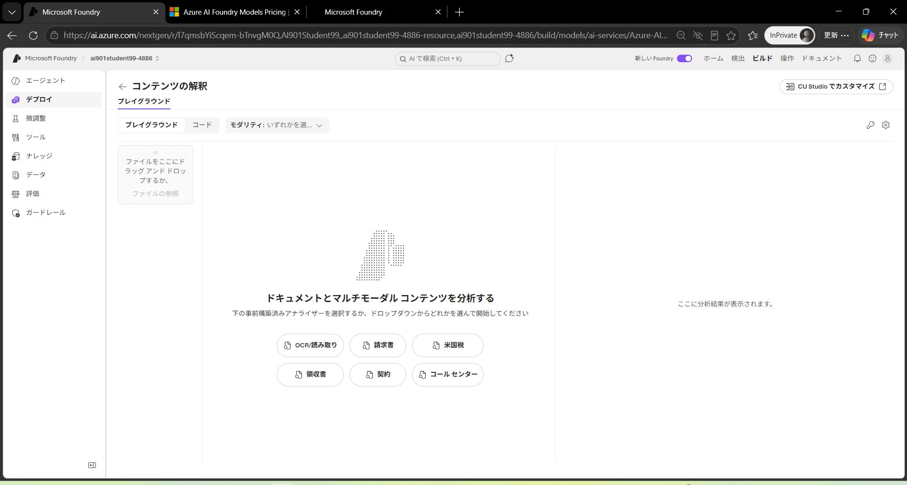
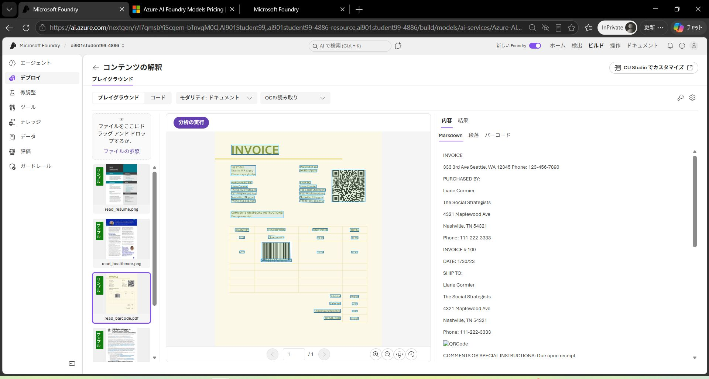
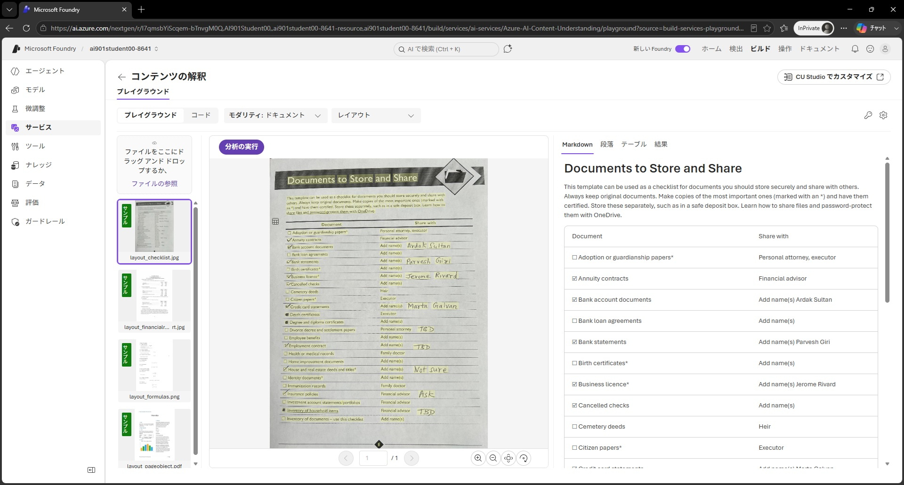
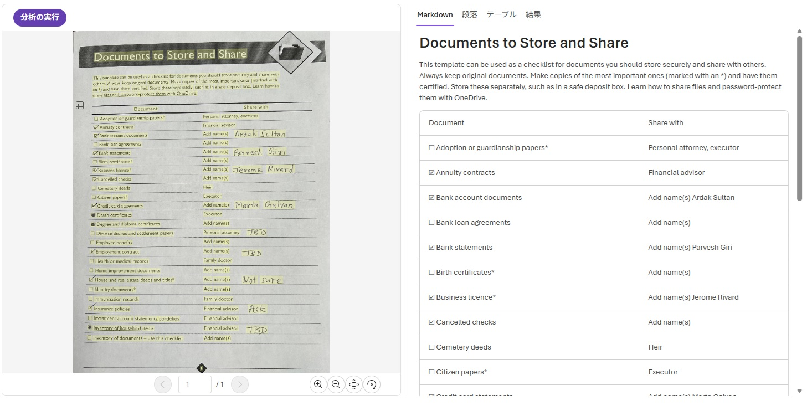
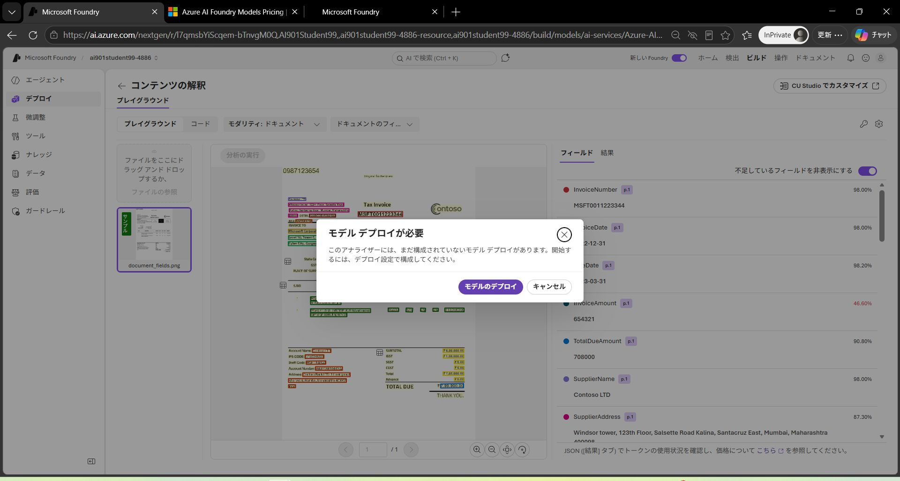
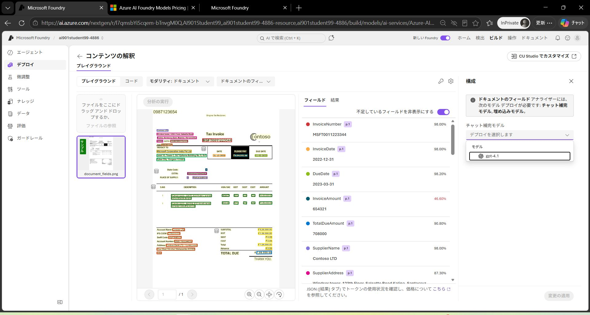
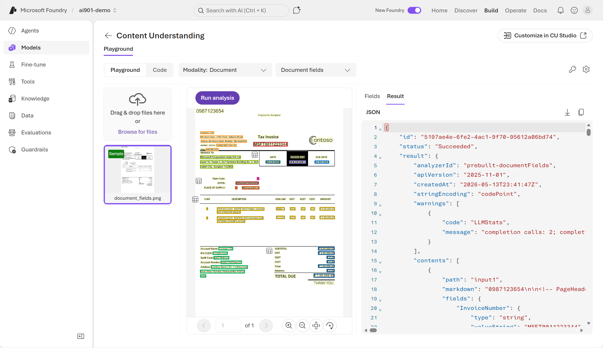
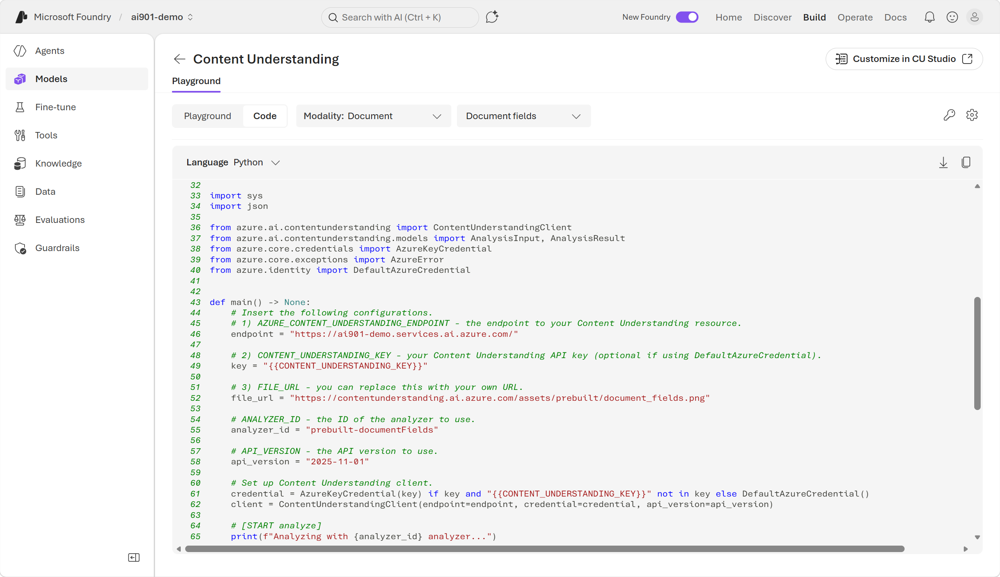

---
lab:
  title: Microsoft Foundry で情報抽出をはじめよう​
  description: AI モデルを使用して視覚データから情報を抽出します。
  level: 200
  duration: 25 minutes
  islab: true
  primarytopics:
    - Microsoft Foundry
---

# Microsoft Foundry で情報抽出をはじめよう

この演習では、Microsoft のインテリジェント アプリケーション作成プラットフォームである Foundry の Azure Content Understanding を使用します。

Azure Content Understanding は AI モデルを使用して、構造化されていないマルチモーダル コンテンツ（ドキュメント、画像、動画、音声）を JSON などの構造化された使用可能な出力に変換する Foundry サービスです。信頼スコアとソースのグラウンディングを用いて、フィールドの抽出、分類、生成によってコンテンツを処理します。

この演習の所要時間は約 **20** 分です。

>**注**: この演習では *新しい* Foundry ポータル エクスペリエンスを使用します。

> **前提条件**: 演習環境準備 (00) で作成した Microsoft Foundry プロジェクトを使用します。まだプロジェクトを作成していない場合は、先に 00 の演習を完了してください。

## 新しい Foundry ポータルでドキュメントから情報を抽出する

1. Web ブラウザーで `https://ai.azure.com` の <a href="https://ai.azure.com" target="_blank">Microsoft Foundry</a> を開き、Azure の資格情報を使用してサインインします。演習環境準備 (00) で作成したプロジェクトを選択します。

1. *新しい* Foundry ポータルで、画面上部のメニューから **ビルド** を選択します。
2. 画面左側のメニューから **サービス** を選択します。

    

3. 一覧から **コンテンツの解釈** を選択してプレイグラウンドを開きます。

    `コンテンツの解釈` プレイグラウンドでは、**モダリティ** ドロップダウンを使用して分析するコンテンツの種類と機能を選択します。

    

#### Content Understanding の *Read* 機能を試す

*Read* 機能はコンテンツ理解の最初のステップで、テキストを読んで抽出しますが、まだ構造や意味の理解は試みません。

1. **モダリティ** ドロップダウンから **ドキュメント** を選択します。
2. 次に表示されるドロップダウンから **OCR/読み取り** を選択します。

3. サンプルの **read_barcode.pdf** を選択し、**分析の実行** ボタンを使用してドキュメントから情報を抽出します。分析が完了したら結果を確認します。

    

4. 次の機能を試すには、ドロップダウンから別のアナライザーを選択します。

#### Content Understanding の *Layout* 機能を試す

1. **モダリティ** ドロップダウンで **ドキュメント** のまま、次のドロップダウンから **レイアウト** を選択します。

2. サンプルの **layout_checklist.jpg** を選択し、**分析の実行** ボタンを使用してそこから情報を抽出します。分析が完了したら結果を確認します。

    

3. コンテンツ出力で **テーブル** タブを選択します。*レイアウト* アナライザーがコンテンツのテキストと構造の両方を取得できることを確認します。

    

4. 次の機能を試すには、ドロップダウンから別のアナライザーを選択します。

#### Content Understanding のその他のアナライザー機能を試す

1. 次のドロップダウンから **ドキュメントのフィールド** を選択します。Azure Content Understanding の別のアナライザーをテストします。

2. **モデル デプロイが必要** ダイアログが表示された場合は、**モデルのデプロイ** を選択します。

    

3. 右側の **構成** パネルが開きます。**ドキュメントのフィールド アナライザー** には追加のモデル デプロイが必要です。**チャット補完モデル** と **埋め込みモデル** のドロップダウンから推奨モデルを選択します。次に **変更の適用** を選択します。

    

    >**ヒント**: *ドキュメントのフィールド* やその他の複雑な抽出ニーズには、複数の AI モデルのデプロイが必要です。各デプロイは特定のモデル バージョンまたは機能に紐付けられているためです。Azure AI Foundry で複数のモデルを使用することで、さまざまな種類の処理タスクをより効果的に処理でき、各ニーズに適切なモデルを選択する柔軟性が得られます。

    変更が適用されたら **構成** パネルを閉じることができます。

4. フル アナライザーを独自の請求書で試してみましょう。新しいブラウザー ウィンドウを開きます。次の URL を入力して **<a href="https://raw.githubusercontent.com/MicrosoftLearning/mslearn-ai-fundamentals/refs/heads/main/data/content-understanding/contoso-invoice-1.pdf" target="_blank">contoso-invoice-1.pdf</a>** をダウンロードします。`https://raw.githubusercontent.com/MicrosoftLearning/mslearn-ai-fundamentals/refs/heads/main/data/content-understanding/contoso-invoice-1.pdf`

5. **ファイルの参照** リンクを使用して、ダウンロードした **contoso-invoice-1.pdf** ドキュメントをアップロードします。**分析の実行** を選択して結果を確認します。テキストがレンダリングされるだけでなく、レイアウトが取得され、フィールドが体系的なカテゴリに整理されていることに注目してください。

    

6. 抽出されたフィールドが表示されている右側のペインで、**結果** タブを選択して JSON の生の結果を表示します。使用されたアナライザーの種類が含まれている **analyzerID** フィールドを確認します。組み込みの Content Understanding アナライザーのリストは[こちら](https://learn.microsoft.com/azure/ai-services/content-understanding/concepts/prebuilt-analyzers)で確認できます。

     

>**ヒント**: *フィールド* タブは *結果* タブの生の JSON からの情報をユーザーにわかりやすい形で表示していることを覚えておいてください。

## Python SDK を使用してコンテンツを抽出する方法を理解する

1. または、開発者はコードを使用してドキュメントを *ドキュメントのフィールド* アナライザーに送信することもできます。Foundry プレイグラウンドはコード サンプルを提供しています。**コード** タブを選択して、この応答を処理して抽出されたフィールドを活用するために使用できるコードを確認します。

    

## まとめ

この演習では、Foundry の Azure Content Understanding を探索し、非構造化コンテンツを構造化された使用可能なデータに変換する方法を学びました。3 つのアナライザーを試し、それぞれが前のものよりも機能が増しています。

- **OCR/読み取り**: 構造や意味を解釈せずにドキュメントから生のテキストを抽出します。「ここにはどんなテキストがあるか？」という問いに答えます。
- **レイアウト**: テーブルを含む構造、階層、位置情報を取得します。「このコンテンツはどのように整理されているか？」という問いに答えます。
- **ドキュメントのフィールド**: フィールドを抽出し体系的なカテゴリに整理して洞察を生成する機能を組み合わせたアナライザー。「このコンテンツは何を意味し、どうすべきか？」という問いに答えます。このような Content Understanding アナライザーは、複雑な抽出ニーズを処理するために（チャット補完モデルや埋め込みモデルなど）追加の AI モデルのデプロイが必要な場合があります。

また、開発者が **Python SDK** を使用して Content Understanding をアプリケーションに統合する方法も学びました。Foundry プレイグラウンドの外でドキュメントをプログラムで分析できます。
